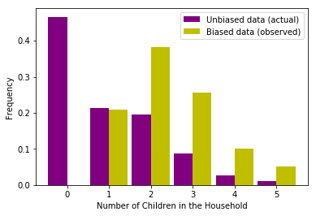

[Think Stats Chapter 3 Exercise 1](http://greenteapress.com/thinkstats2/html/thinkstats2004.html#toc31) (actual vs. biased)

```python
from collections import Counter
import matplotlib.pyplot as plt

def normalize(d) :
    f = 1/sum(d.values())
    for v in d :
        d[v] = d[v]*f
    return d

resp = nsfg.ReadFemResp()

hhkd = Counter(resp['numkdhh'])

keys = hhkd.keys()
vals = hhkd.values()
biasedvals = [x*p for x,p in hhkd.items()]

unbiased = normalize(dict(zip(keys,vals)))
biased = normalize(dict(zip(keys,biasedvals)))

plt.bar(unbiased.keys(),unbiased.values(),width=-.45, color='purple',align='edge')
plt.bar(biased.keys(),biased.values(),width=.45,align='edge',color='y')
plt.xlabel('Number of Children in the Household')
plt.ylabel('Frequency')
plt.legend(['Unbiased data (actual)','Biased data (observed)'])

#returns :
```

