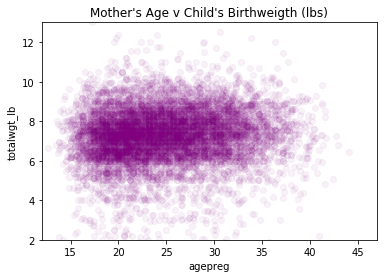
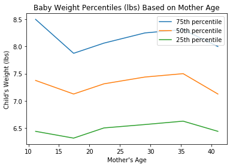

[Think Stats Chapter 7 Exercise 1](http://greenteapress.com/thinkstats2/html/thinkstats2008.html#toc70) (weight vs. age)
```python
import matplotlib.pyplot as plt
import numpy as np
import pandas as pd


#Scatterplot
plt.scatter(live.agepreg,live.totalwgt_lb,alpha = .05,c='purple')
plt.axis([12,47,2,13])
plt.xlabel('agepreg')
plt.ylabel('totalwgt_lb')
plt.title("Mother's Age v Child's Birthweigth (lbs)")
plt.show()

#Percentiles
bins = np.arange(12,47,7)
ixs = np.digitize(live.agepreg,bins)
groups = live.groupby(ixs)
ages = [group.agepreg.mean() for i,group in groups]
cdfs = [thinkstats2.Cdf(group.totalwgt_lb) for i,group in groups]
for percent in [75,50,25]:
    weights = [cdf.Percentile(percent) for cdf in cdfs]
    plt.plot(ages,weights)
    plt.legend(['75th percentile','50th percentile','25th percentile'])
    plt.xlabel("Mother's Age")
    plt.ylabel("Child's Weight (lbs)")
    plt.title('Baby Weight Percentiles (lbs) Based on Mother Age')
plt.show()
    
#Pearson
p = np.corrcoef(live.agepreg,live.totalwgt_lb)[0][1]
print(f'The Pearson correlation is approximately {round(p,2)}.\n')

#Spearman
ages = pd.Series(live.agepreg)
weights = pd.Series(live.totalwgt_lb)
s=ages.corr(weights,method='spearman')
print(f'The Spearman correlation is approximately {round(s,2)}.')

#Based on the correlations, I would say that there is either 
#no relationship or a non-linear relationship between the variables

#returns two graphs (below in order) and the following :

#The Pearson correlation is approximately 0.07.
#The Spearman correlation is approximately 0.09.
```



